# 🩺 Klinik App

   

App Shoping UBSI (ASU) adalah aplikasi penjualan berbasis Mobile dengan menggunakan framework Flutter. Terdapat 3 menu utama yang terdapat pada aplikasi ini yakni Home Screen, Favourite dan Profile untuk User.
 
dan untuk tampilan admin terdapat 4 Menu utama yakni Admin Home Page, Upload Image, List User, List Product, 

## 💻 Pengguna Sistem
Pengguna yang dapat memakai sistem ini adalah hanya Admin.

## 👨‍💻 Skenario Kebutuhan Pengguna
### Admin
<ol>
  <li>Admin dapat melakukan login.</li>
  <li>Admin dapat melihat, menambahkan, memperbarui dan menghapus data Barang .</li>
  <li>Admin dapat melihat, menambahkan, memperbarui dan menghapus data pengguna.</li>
  <li>Admin dapat melihat, menambahkan, memperbarui dan menghapus data Pasien.</li>
  <li>Admin dapat melakukan logout.</li>
</ol>

### User
<ol>
  <li>User dapat melakukan login.</li>
  <li>User dapat melakukan pendaftaran/ registrasi </li>
  <li>User dapat melihat, menambahkan, memperbarui dan menghapus data Barang .</li>
  <li>User dapat menghubungi costumer service</li>
  <li>user dapat melakukan proses pembelian barang.</li>
  <li>User dapat melakukan logout.</li>
</ol>

## 🖼️ Screenshot Aplikasi
<table width="100%">
  <tbody>
    <tr>
    <td width="33%">
        <h5 style="text-align: center">Onboarding Form</h5>
        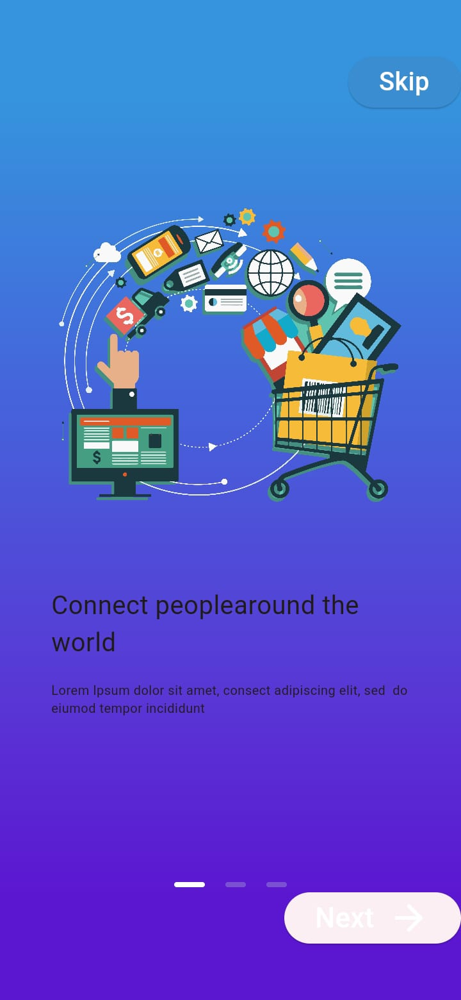
      </td>
      <td width="33%">
        <h5 style="text-align: center">Login Form</h5>
        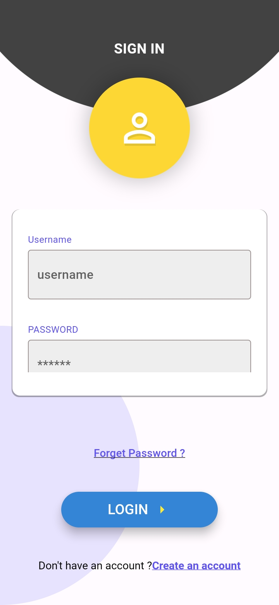 
      </td>
      <td width="33%">
        <h5 style="text-align: center">Form Register</h5>
        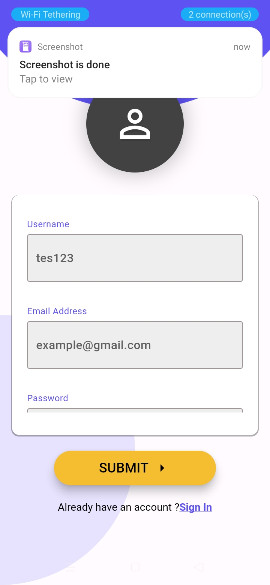
      </td>  
    </tr>
    <tr>
      <td width="33%">
        <h5 style="text-align: center">Form User Home Screen</h5>
        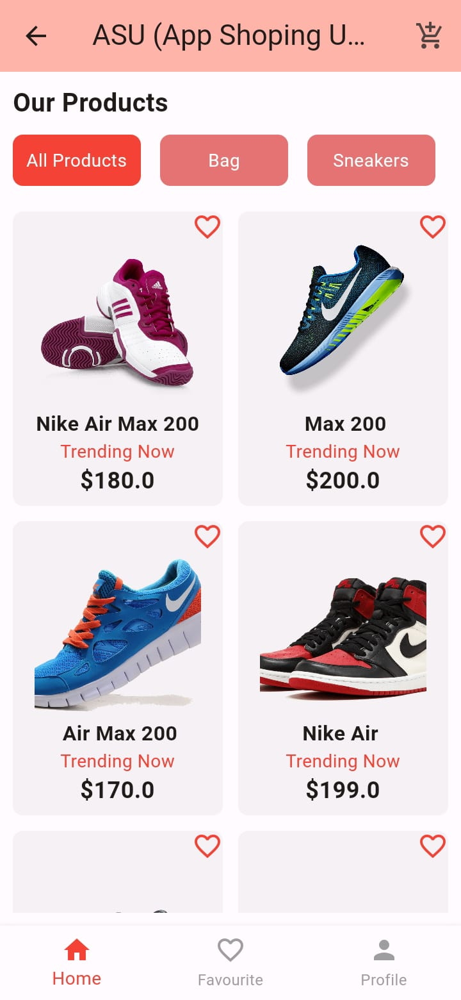
      </td> 
      <td width="33%">
        <h5 style="text-align: center">Favourite Screen</h5>
        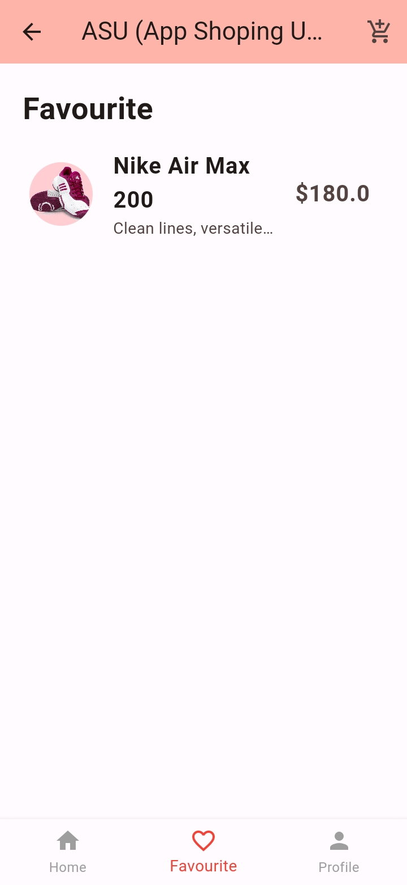
      </td> 
      <td width="33%">
        <h5 style="text-align: center">Keranjang Belanja</h5>
        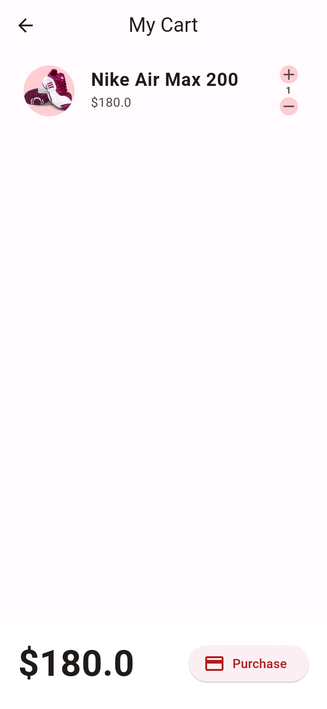
      </td> 
    </tr>
    <tr>
    <td width="33%">
        <h5 style="text-align: center">Profile Screen</h5>
        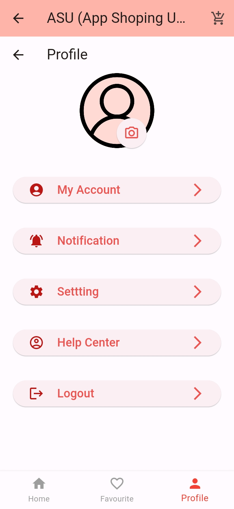
      </td> 
      <td width="33%">
        <h5 style="text-align: center">Setting Screen</h5>
        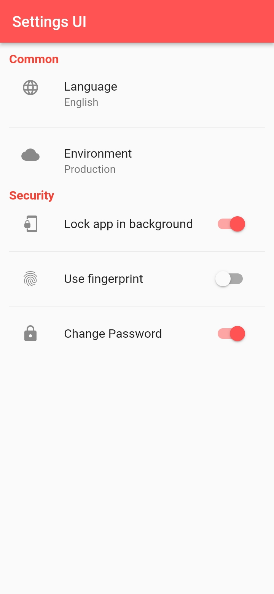
      </td> 
      <td width="33%">
        <h5 style="text-align: center">Help Center</h5>
        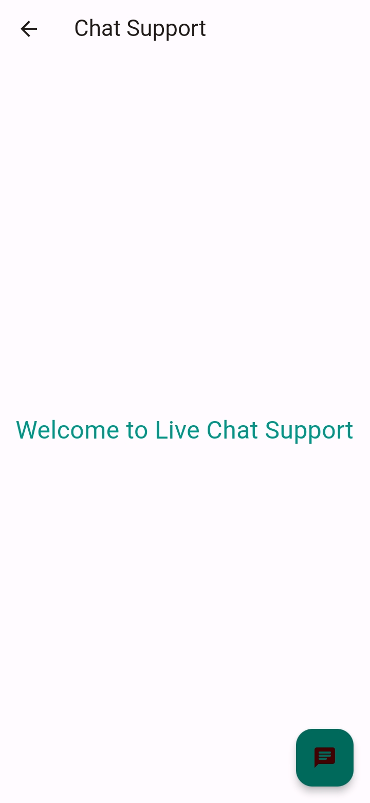
      </td> 
    </tr>
    <tr>
    <td width="33%">
        <h5 style="text-align: center">Admin Drawer</h5>
        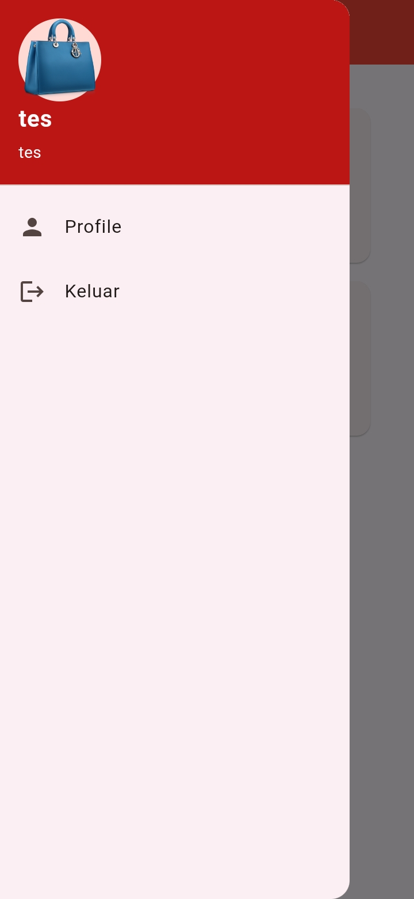
      </td> 
      <td width="33%">
        <h5 style="text-align: center">Admin Page</h5>
        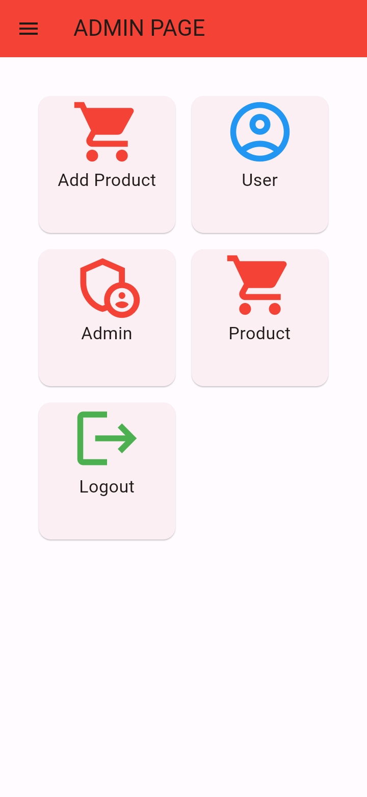
      </td> 
      <td width="33%">
        <h5 style="text-align: center">List Product</h5>
        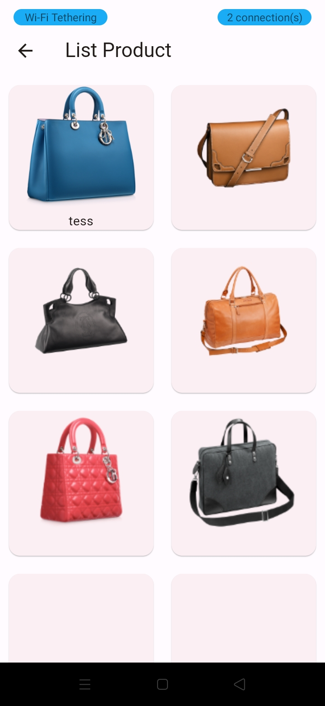
      </td> 
    </tr>
    <tr>
    <td width="33%">
        <h5 style="text-align: center">List User</h5>
        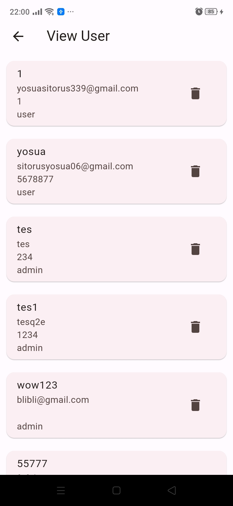
      </td> 
      <td width="33%">
        <h5 style="text-align: center">Upload Image</h5>
        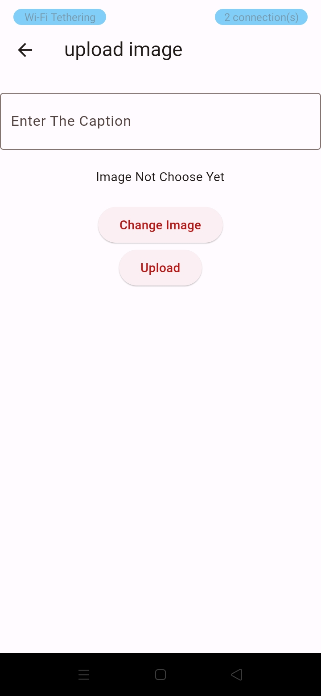
      </td> 
      <td width="33%">
        <h5 style="text-align: center">Payment Success</h5>
        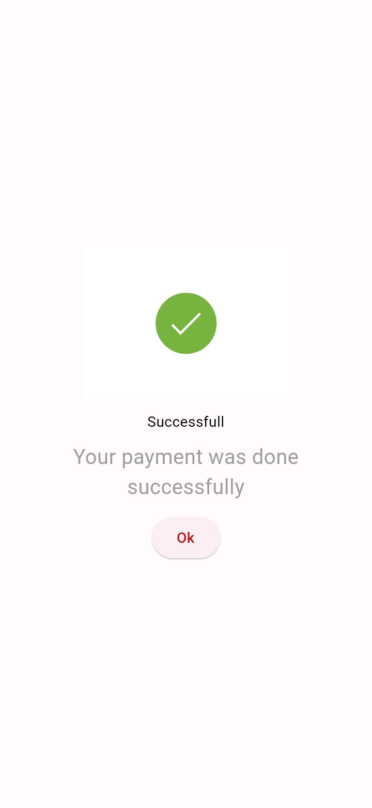
      </td> 
    </tr>
  </tbody>
</table>

## 📝 Prerequisite
Untuk menjalankan aplikasi ini disarankan untuk menyiapkan aplikasi berikut ini :
  - [x] Android Studio Giraffe <code>2022.03.1 Patch 1</code>
  - [x] Flutter <code>3.13.2</code>
  - [x] Dart <code>3.1.0</code>
  - [x] Java JDK <code>19.0.0</code>
  - [x] Git <code>2.35.1</code>

## 📜 Credit & License
Project ini mengacu pada modul praktik dari mata kuliah Mobile Programming Universitas Bina Sarana Informatika (UBSI). Project ini bersifat open-source untuk edukasi.
<blockquote>Kuliah...? BSI AJA !!</blockquote>